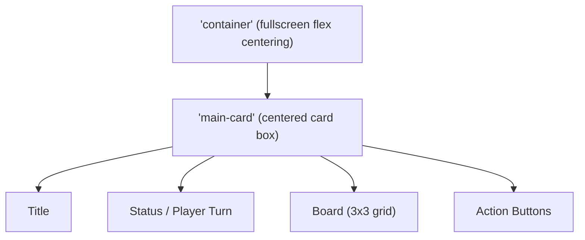

# Tic Tac Toe Angular Frontend — Architecture Document

## Overview

This document provides an architectural overview of the Tic Tac Toe Angular frontend application. It outlines the application structure, key features, core components, layout and styling strategies, main data flows, responsive/minimalistic design patterns, and how the interface achieves a modern, light-themed user experience.

---

## 1. Application Structure and Layers

The application adheres to Angular's modular and component-based architecture. For this minimal single-page app, structure is streamlined but still divided into clear logical layers:

- **Presentation/UI Layer**: All user-facing UI/UX elements are defined here, including the game grid, buttons, and dynamic status areas.
- **Component Logic Layer**: Encapsulates the application's interactive logic—game state, user actions, win/draw detection, player turn management.
- **Configuration/Bootstrap Layer**: Handles Angular bootstrapping, server-side rendering config, routing, and app initialization.

### File & Directory Organization

```
/src
  /app
    app.component.ts      # Main component logic (game state, user actions)
    app.component.html    # UI template
    app.component.css     # Scoped styles for the main component
    app.config.ts         # Angular app config (client)
    app.config.server.ts  # Angular app config (server-side rendering)
    app.routes.ts         # (Empty; no additional routes needed)
  index.html              # HTML entrypoint; loads Angular app
  styles.css              # Global minimalistic style and normalization
main.ts                   # Client-side bootstrap
main.server.ts            # SSR bootstrap
server.ts                 # Express server for SSR build
```

---

## 2. Key Features & Core Components

### Core Features

- **Start New Game**: Initializes a new, empty 3x3 game board, resets all game states.
- **Reset Game**: Restores the board to its initial state. Functionally identical to starting a new game.
- **Current Player Turn Display**: UI dynamically indicates which player's move it is ("X" or "O").
- **Win/Draw Detection**: Automatically checks for win or draw after each move and displays the outcome.
- **Minimal User Actions**: Only start, reset, or place a move by clicking on a cell; no unnecessary steps or distractions.
- **Responsive Design**: Layout and elements gracefully adapt to all screen sizes, from desktop to mobile.

### Main (and Only) Component

- **AppComponent**:
   - Controls all game logic and state.
   - Maintains the 3x3 board array, current player, winner/draw state, in-game flag, and move counter.
   - Handles user interactions (cell clicks, starting/resetting).
   - Drives the UI updates (current turn, winner, cell disables, highlighting).
   - Exposes key methods tied to UI:
     - `newGame()`: Start new game logic.
     - `resetGame()`: Soft reset of game state.
     - `makeMove(i, j)`: Processes a player's move.
     - `statusMsg`: Computed status display string.

### UI Template Structure

The UI is constructed with accessible, semantic HTML and a clear logical flow:

- **Header**: Displays the app title.
- **Status Area**: Shows the current player's turn, winner, or draw state dynamically.
- **Game Board**: 3x3 grid of buttons, one per cell, with real-time updates/disable logic.
- **Action Buttons**: 'Start New' and 'Reset' controls.

---

## 3. Layout Strategy and Main Data Flow

### UI Layout

The overall layout follows a *centered card* pattern:
- The main card is centered vertically and horizontally.
- Title at the top, followed by status, game grid, and control buttons at the bottom.
- The grid uses a visually even, gap-based layout, making it readable and touch-accessible.

#### Layout Diagram (Simplified)



### Data Flow

The data flow is straightforward:
- **User Action** (cell click, new/reset): triggers a method in `AppComponent`
- **Component Logic** updates game state (board, player, winner)
- **Template & Data Binding**: Angular's template binding reflects new state immediately in UI (board cells, status, button disables)
- **Win/Draw Logic**: After each move, checks for win/draw; disables board when game over
- **Action Buttons**: Allow users to start/reset games; 'Start New' is disabled while in a game

---

## 4. Responsive and Minimalistic Design Approach

### Responsive Design

Responsiveness is achieved through:
- Fluid/flex-based layout for both the page and game board (`display: flex`, `gap`, auto-centering).
- Use of relative units (em, rem, vw) for padding, font sizes, button sizes.
- Media queries adapt the padding, cell sizes, and font sizes for viewports under 480px width, ensuring usability on phones and small screens.

### Minimalistic/Modern UI

- Flat backgrounds, no distracting gradients or borders.
- *Large*, central game grid with clear touch targets.
- Typography relies on a neutral sans-serif stack, with accent coloring only for primary actions/status.
- Concise status messages and limited on-screen controls.

### Accessibility

- Uses semantic roles: board as `role="grid"`, rows as `role="row"`, and each cell as `role="gridcell"`.
- ARIA labels help screen readers identify cell positions and status.
- Disabled states (`:disabled`) visually and functionally prevent interaction after move or game end.

---

## 5. Theming: Modern Light Style

The UI's visual style is defined to be light, bright, and modern:

- **Backgrounds**: All page and cards use white (`#fff` or `#ffffff`) backgrounds for freshness and clarity.
- **Primary Color**: Blue (`#1976d2`) is used for header/title, "X" player, and primary action buttons, providing visual pop.
- **Accent Color**: A yellow/gold (`#fbc02d`) is used for "O" player and the secondary action button.
- **Card & Buttons**: Soft shadowing and border radii (`box-shadow`, `border-radius`) create depth without heaviness.
- **Win State**: Light blue background highlight (`#e8f2fe`) for winning cells—prepared for possible UI enhancement.
- **Typography**: Large font sizes for main elements, with color cues for active/inactive/disabled states.

#### Core Styles Extract

- `background: #fff` for the main page.
- `background: #ffffff` and `box-shadow` for the main card.
- `.cell` uses `#f9fbfd` with color `#1976d2` for clarity.
- Buttons: `.primary` uses blue, `.secondary` uses gold.
- Responsive: media query reduces card/cell size for mobile devices.

---

## 6. Component Interactions & UI Behavior

- Every UI action (start, reset, move) calls a single method in `AppComponent`; no external dependencies or state management.
- The board disables moves once a cell is filled or a winner/draw is detected.
- The UI immediately reflects all state changes through Angular's binding (`{{ ... }}`).
- Status display dynamically reflects the game state: whose turn, draw, or winner.
- The design ensures no user is ever more than one click from starting a new game or resetting.

---

## 7. Summary & Extensibility

This app embodies the minimal Angular single-component approach, balancing functional clarity with modern UI/UX. The codebase and architecture support fast development, easy modification (e.g., to expand game variants or UX), and ensures strong mobile and accessibility support out of the box.

---

## References

- See `app.component.ts` (logic), `app.component.html` (markup), and `app.component.css` (styling) for further reference.
- Root styles: `src/styles.css` for global minimalistic reset and font choices.

